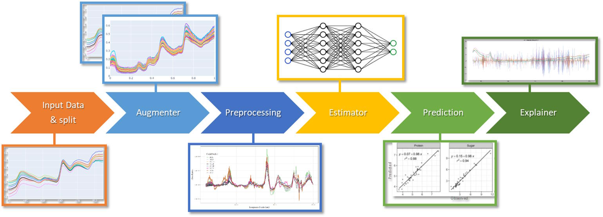

# Summary

NIRS measures the light reflected from a sample after it has been exposed to wavelengths ranging from visible to shortwave infrared. This provides a signature of the physical and chemical properties of the sample. Thanks to its low cost, NIRS has been widely used to determine chemical properties in various fields - pharmaceutical, agricultural and food ([@Shepherd2007]; [@Biancolillo2018Chemometric]; [@Pasquini2018Near]).Although NIRS data are easy to acquire, they quickly generate a very large amount of information, and this information needs to be processed to enable quality predictions for the desired properties. Pinard provides a set of Python functionalities dedicated to the pre-processing and processing of NIRS data, and allows the rapid development of prediction models thanks to the extension of scikit-learn pipelines. Pinard has been successfully used in a number of scientific projects ([@Vasseur2022Perspective], [@Przybylska2023AraDiv]).

# Statement of need

While NIRS data are easy to acquire and rapidly generate a very large amount of information, they also require extensive post-processing through chemiometric and multivariate statistical analyses. Typically, spectral information can be exploited by developing calibration models that relate spectra to reference trait data. Various statistical methods are commonly used to predict trait data from spectra, including partial least squares regression (PLSR; [@Wold1983Multivariate]), principal component analysis and 2D correlation plots [@Darvishzadeh2008LAI]. However, (1) the performance of these methods, especially PLSR, has been shown to vary significantly across samples depending on conditions [@fu2020estimating], and (2) the strong statistical background of the methods used has limited the integration of methods developed outside platforms such as R or Matlab. In recent years, machine learning approaches have been widely adopted in various fields due to their better predictive performance and have been successfully applied in NIRS ([@Vasseur2022Perspective]; [@Zhang2022Review]; [@Le2020Application]). Machine learning tools and methods lean heavily on the Python language, making their adoption by the chemometrics community rather complex. Pinard offers a way to overcome this difficulty by providing all the traditional tools of NIRS analysis (dedicated signal processing, dataset splitting methods, etc.) but compatible with the scikit-learn pipelines. Scikit-learn pipelines provide an elegant and efficient way to assemble several processing steps and are compatible with the most popular machine learning libraries (scikit-learn, tensorflow, pytorch, etc.).

*Illustrated End-to-End NIRS Analysis Pipeline using Pinard, Scikit-learn and Tensorflow: Data Input, Augmentation, Preprocessing, Training, Prediction, and Interpretation*

# Acknowledgements

We acknowledge contributions from the Phenomen team at [CIRAD](https://www.cirad.fr).

# References